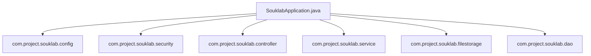

# SoukLab Application Root (`com.project.souklab`)

Root package containing the main Spring Boot bootstrap entrypoint and foundational package declarations.

---

## Architecture Role

The root package serves as the component scanning origin (`@SpringBootApplication`). All child packages (`config`, `controller`, `service`, `dao`, `model`, `dto`, `filestorage`, `security`, `util`, `exception`, `validation`) are scanned and auto-wired from this namespace.

---

## Classes

| Class | Type | Responsibility |
| :--- | :--- | :--- |
| [`SouklabApplication`](SouklabApplication.java) | Class | `@SpringBootApplication`, `@EnableAsync`, `@EnableTransactionManagement` entry point. Configures the Spring ApplicationContext and starts the embedded Tomcat server. |

---

## Subpackages Overview

- **`config`**: Spring bean definitions, CORS, clock, security configuration, and async settings.
- **`controller`**: REST API resource adapters and controllers.
- **`dao`**: Spring Data JPA repositories.
- **`dto`**: Request and response data transfer objects.
- **`exception`**: Custom business exceptions and global exception translation.
- **`filestorage`**: Pluggable file storage engine (MinIO/S3, ClamAV antivirus, image processing).
- **`model`**: JPA domain entities and lifecycle audit models.
- **`security`**: Security filters, JWT authentication, and token rate limiting.
- **`service`**: Core transactional business logic and domain workflows.
- **`util`**: Stateless helpers (security context, code generation, email dispatch).
- **`validation`**: Custom Jakarta Bean Validation constraints.
