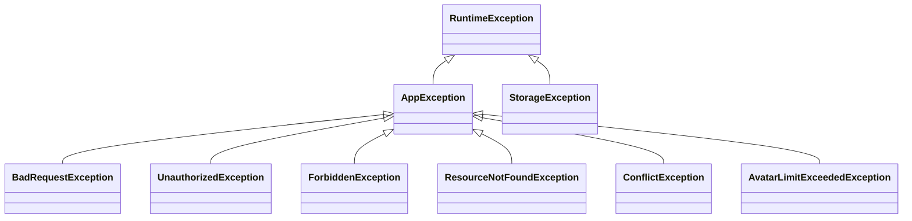

# Exception Handling Package (`com.project.souklab.exception`)

Centralized application exception hierarchy and global controller advice translation.

---

## Exception Hierarchy

---

## Classes Reference

| Exception Class | HTTP Status | Default Error Code | Usage Scenario |
| :--- | :---: | :--- | :--- |
| [`AppException`](AppException.java) | Abstract | Custom | Base class holding `HttpStatus` and string `errorCode`. |
| [`BadRequestException`](BadRequestException.java) | `400 Bad Request` | `BAD_REQUEST` | Validation failures, invalid parameters, active cooldowns. |
| [`UnauthorizedException`](UnauthorizedException.java) | `401 Unauthorized` | `UNAUTHORIZED` | Invalid credentials, expired or malformed JWT tokens. |
| [`ForbiddenException`](ForbiddenException.java) | `403 Forbidden` | `FORBIDDEN` | Access denied, unverified emails, inactive accounts. |
| [`ResourceNotFoundException`](ResourceNotFoundException.java) | `404 Not Found` | `RESOURCE_NOT_FOUND` | Missing entity, foreign query-scoped items, soft-deleted rows. |
| [`ConflictException`](ConflictException.java) | `409 Conflict` | `CONFLICT` | Duplicate email registrations, state transition conflicts. |
| [`AvatarLimitExceededException`](AvatarLimitExceededException.java) | `400 Bad Request` | `AVATAR_LIMIT_EXCEEDED` | User exceeds configured gallery avatar upload limit. |
| [`GlobalExceptionHandler`](GlobalExceptionHandler.java) | `@RestControllerAdvice` | Unified | Intercepts all application exceptions, validation errors, and storage errors, formatting them into consistent `ApiResponse` error envelopes. |
