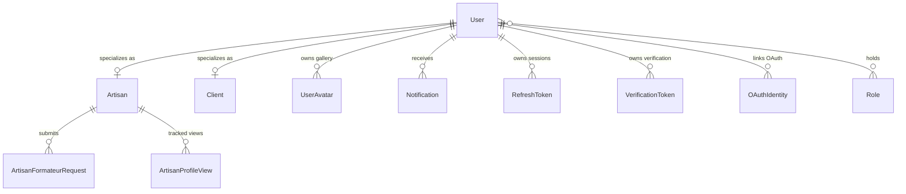

# Domain Model Layer (`com.project.souklab.model`)

JPA entity models, enums, and base lifecycle abstractions mapped to MariaDB/MySQL tables.

---

## Entity Relationship Diagram

---

## Entities & Enums Reference

| Class / Enum | Type | Description |
| :--- | :---: | :--- |
| [`BaseEntity`](BaseEntity.java) | `@MappedSuperclass` | Provides auto-generated UUID `id`, `createdAt`, `updatedAt`, and soft-delete `deletedAt` timestamps. |
| [`User`](User.java) | `@Entity` | Central identity entity. Manages email, hashed credentials, `AccountStatus`, ban details, and assigned roles. |
| [`Artisan`](Artisan.java) | `@Entity` | Artisan profile details: biography, craft taxonomies, `isTeacher` flag, ratings, and view counts. |
| [`Client`](Client.java) | `@Entity` | Client profile details: client type, company name, and premium membership status. |
| [`Role`](Role.java) | `@Entity` | Platform authority (`ROLE_CLIENT`, `ROLE_ARTISAN`, `ROLE_ADMIN`). |
| [`Notification`](Notification.java) | `@Entity` | In-app notification holding recipient reference, message, `NotificationType`, and `read` status. |
| [`NotificationType`](NotificationType.java) | `enum` | Catalog of notification triggers (`ACCOUNT_VALIDATED`, `FORMATEUR_GRANTED`, etc.). |
| [`ArtisanFormateurRequest`](ArtisanFormateurRequest.java) | `@Entity` | Formateur teacher accreditation application with status, cooldown date, and review notes. |
| [`FormateurRequestStatus`](FormateurRequestStatus.java) | `enum` | Lifecycle states: `PENDING`, `APPROVED`, `REJECTED`. |
| [`ArtisanProfileView`](ArtisanProfileView.java) | `@Entity` | Deduplicated profile view record tracking unique visitor impressions per artisan. |
| [`UserAvatar`](UserAvatar.java) | `@Entity` | Gallery avatar entity storing URLs for thumbnail (150x150), medium (500x500), and full (original) resolution tiers, plus `isActive` indicator. |
| [`RefreshToken`](RefreshToken.java) | `@Entity` | Long-lived cryptographically secure token for JWT rotation with expiry tracking. |
| [`VerificationToken`](VerificationToken.java) | `@Entity` | Single-use 6-digit verification codes for email activation and password resets. |
| [`VerificationTokenType`](VerificationTokenType.java) | `enum` | Token categories: `EMAIL_VERIFICATION`, `PASSWORD_RESET`. |
| [`OAuthIdentity`](OAuthIdentity.java) | `@Entity` | Third-party OAuth provider binding (Google subject ID linked to SoukLab user). |
| [`AuditLog`](AuditLog.java) | `@Entity` | Administrative audit trail record capturing security events and moderation actions. |
| [`AuditLogAction`](AuditLogAction.java) | `enum` | Event codes (`APPROVE_USER`, `BAN_USER`, `TIMEOUT_USER`, `EMAIL_VERIFIED`). |
| [`AccountStatus`](AccountStatus.java) | `enum` | Account state machine: `PENDING`, `ACTIVE`, `SUSPENDED`. |
